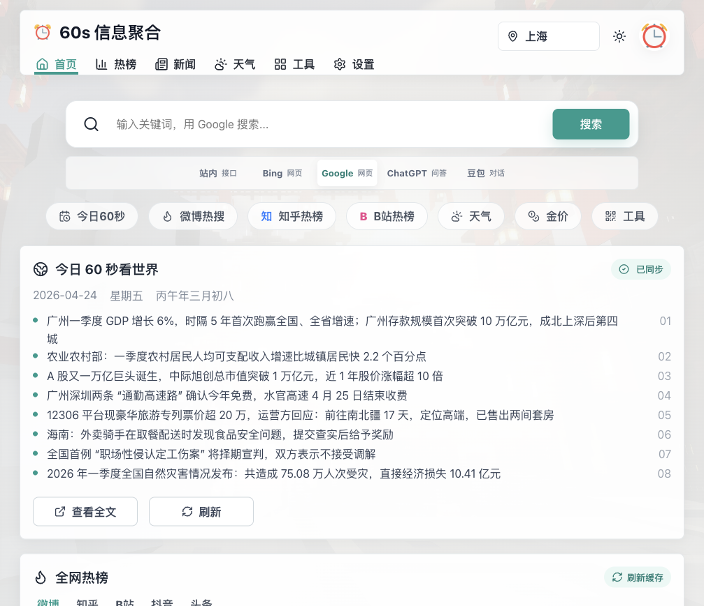

# 60s-web

一个基于 [vikiboss/60s](https://github.com/vikiboss/60s) API 的信息聚合与导航首页。项目定位是轻量、可自定义、适合长期挂在浏览器首页的 60 秒信息面板。



## 特性

- 今日 60 秒新闻、热榜、天气、金价、油价、汇率、电影票房、Epic 免费游戏等信息聚合
- 多热榜平铺展示，支持微博、知乎、B 站、抖音、头条等来源
- 工具中心：翻译、二维码、密码生成、配色方案、接口实验室
- 搜索框支持站内接口搜索，也可跳转 Bing、Google、ChatGPT、豆包
- 本地偏好设置：默认城市、API 地址、模块显隐、10 分钟缓存刷新
- 个性化：头像上传/QQ 头像缓存、壁纸、自定义外壳主题
- 支持 Vercel、Cloudflare Pages、Docker 等部署方式

## 技术栈

- Runtime / 包管理：Bun
- 前端：React 19、TypeScript、Vite
- 图标：lucide-react
- 数据来源：[vikiboss/60s](https://github.com/vikiboss/60s)

## 本地开发

```bash
bun install
bun run dev
```

默认开发服务会监听 `0.0.0.0`，本机访问：

```text
http://localhost:5173
```

构建生产版本：

```bash
bun run build
```

本地预览：

```bash
bun run preview
```

## 配置说明

应用默认使用：

```text
https://60s.viki.moe/v2
```

你可以在页面 `设置 -> 默认 API` 中替换为自己的 60s API 服务地址。设置会保存在浏览器 localStorage，不需要后端数据库。

## 部署到 Vercel

### 方式一：GitHub 导入

1. Fork 或推送本项目到 GitHub，例如 `dogxii/60s-web`
2. 在 Vercel 中选择 `Add New... -> Project`
3. 导入 GitHub 仓库
4. Vercel 通常会自动识别 Vite 项目；如果需要手动配置：

```text
Framework Preset: Vite
Install Command: bun install
Build Command: bun run build
Output Directory: dist
```

项目已包含 `vercel.json`，用于 SPA fallback：

```json
{
  "buildCommand": "bun run build",
  "outputDirectory": "dist",
  "installCommand": "bun install",
  "framework": "vite",
  "rewrites": [{ "source": "/(.*)", "destination": "/index.html" }]
}
```

### 方式二：Vercel CLI

```bash
bunx vercel
```

生产部署：

```bash
bunx vercel --prod
```

## 部署到 Cloudflare Pages

1. 打开 Cloudflare Dashboard
2. 进入 `Workers & Pages -> Create application -> Pages`
3. 连接 GitHub 仓库 `dogxii/60s-web`
4. 构建配置：

```text
Framework preset: Vite
Build command: bun run build
Build output directory: dist
Root directory: /
```

5. 在环境变量中指定 Bun 版本：

```text
BUN_VERSION=1.1.0
```

如果 Cloudflare Pages 的 Bun 环境不可用，也可以改用 npm：

```text
Build command: npm install && npm run build
Build output directory: dist
```

## Docker 部署

构建镜像：

```bash
docker build -t 60s-web .
```

运行容器：

```bash
docker run -d --name 60s-web -p 8080:80 60s-web
```

访问：

```text
http://localhost:8080
```

## Docker Compose

```yaml
services:
  60s-web:
    image: 60s-web
    build: .
    ports:
      - "8080:80"
    restart: unless-stopped
```

启动：

```bash
docker compose up -d
```

## Nginx 静态部署

先构建：

```bash
bun install
bun run build
```

然后将 `dist/` 目录部署到任意静态服务器。Nginx 需要添加 SPA fallback：

```nginx
server {
  listen 80;
  server_name example.com;

  root /var/www/60s-web/dist;
  index index.html;

  location / {
    try_files $uri $uri/ /index.html;
  }
}
```

## 与 60s API 项目的关系

本项目是前端页面，聚合展示接口数据；真正的数据能力来自 [vikiboss/60s](https://github.com/vikiboss/60s)。如果你想自托管 API、查看接口列表或参与 API 项目开发，请访问上游仓库。

## 仓库定位

当前前端仓库定位为：

```text
dogxii/60s-web
```

建议用于：

- 个人浏览器首页
- 自部署信息面板
- 60s API 的展示前端
- 轻量导航页

## License

请根据实际发布需要补充许可证文件。
